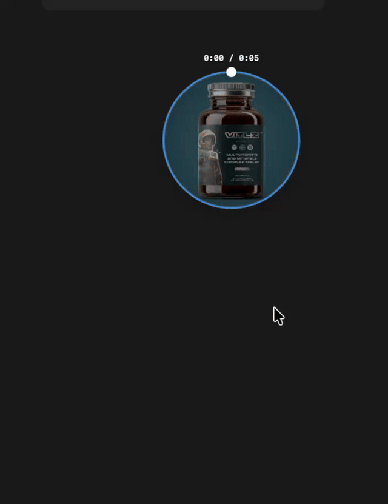

# FloatingMediaPlayer

A Swift Package for **draggable floating video and audio players** in SwiftUI — Telegram-inspired circular mini-player UX with audio support, seekable progress ring, and full UI customization.


[Русская версия](README.ru.md) · [Changelog](CHANGELOG.md)

## Features

- **Video & audio** — automatic media type detection via AVFoundation / AVPlayer
- **Draggable floating window** — reposition anywhere on screen
- **Circular seekable progress ring** — scrub playback by dragging
- **Playback controls** — play/pause, skip, auto-hiding controls
- **Configurable UI** — size, colors, shadows, animation presets (`.minimal`, `.full`, `.compact`)
- **Clean architecture** — protocols, delegates, factory pattern, SPM modules
- **Performance helpers** — debouncing, safe SwiftUI animations, audio session utilities
- **Unit tests** — configuration and factory coverage

## Requirements

- iOS 16.0+ / macOS 13.0+
- Xcode 15.0+
- Swift 5.9+

## Installation

### Swift Package Manager

```swift
dependencies: [
    .package(url: "https://github.com/gromozekapp/FloatingMediaPlayer.git", from: "1.3.5")
]
```

Then add `FloatingMediaPlayer` to your target dependencies.

## Quick Start

```swift
import FloatingMediaPlayer
import SwiftUI

struct ContentView: View {
    let mediaURL: URL

    var body: some View {
        YourContent()
            .overlay {
                FloatingVideoPlayerView(mediaURL: mediaURL)
            }
    }
}
```

### With configuration

```swift
let config = FloatingPlayerConfiguration(
    defaultPosition: CGPoint(x: 200, y: 400),
    defaultSize: 120,
    showControls: true,
    borderColor: .blue,
    allowDragging: true
)

FloatingVideoPlayerView(mediaURL: mediaURL, configuration: config)
```

### With delegate

```swift
final class PlayerEvents: MediaPlayerDelegate {
    func mediaPlayerDidStartPlaying(_ player: MediaPlayerProtocol) {
        print("Playback started")
    }

    func mediaPlayerDidFinishPlaying(_ player: MediaPlayerProtocol) {
        print("Playback finished")
    }

    func mediaPlayerDidChangePosition(_ player: MediaPlayerProtocol, position: CGPoint) {}

    func mediaPlayerDidChangeSize(_ player: MediaPlayerProtocol, size: CGFloat) {}

    func mediaPlayer(_ player: MediaPlayerProtocol, didEncounterError error: Error) {
        print("Error: \(error.localizedDescription)")
    }
}

struct ContentView: View {
    let mediaURL: URL
    @State private var playerEvents = PlayerEvents()

    var body: some View {
        YourContent()
            .overlay {
                FloatingVideoPlayerView(
                    mediaURL: mediaURL,
                    configuration: .full,
                    delegate: playerEvents
                )
            }
    }
}
```

## Configuration Presets

```swift
FloatingVideoPlayerView(mediaURL: mediaURL, configuration: .minimal)
FloatingVideoPlayerView(mediaURL: mediaURL, configuration: .full)
FloatingVideoPlayerView(mediaURL: mediaURL, configuration: .compact)
```

See `FloatingPlayerConfiguration` for position, size, controls timeout, drag behavior, colors, and shadows.

## Supported Formats

**Video:** MP4, MOV, AVI, MKV, M4V, 3GP, WebM  
**Audio:** MP3, M4A, WAV, AAC, FLAC, OGG

## API Overview

| Type | Purpose |
|------|---------|
| `FloatingVideoPlayerView` | Main SwiftUI floating player view |
| `FloatingPlayerConfiguration` | UI and behavior configuration |
| `MediaPlayerDelegate` | Playback and interaction events |
| `MediaPlayerFactory` | Creates video/audio players by URL |
| `MediaPlayerProtocol` | Shared player interface |

## Performance Utilities

```swift
let debouncedUpdate = PerformanceUtils.debounce(delay: 0.3) { value in
    updatePlayerPosition(value)
}

AnimationUtils.safeAnimation(.spring()) {
    playerSize = newSize
}
```

## Testing

```bash
swift test
```

## Demo

<!-- Add a GIF or screenshot before publishing for best visibility -->
<!--  -->

## Roadmap

- Subtitles support
- Keyboard shortcuts
- Playlists
- Custom themes

See [CHANGELOG.md](CHANGELOG.md) for release history.

## Contributing

1. Fork the repository
2. Create a feature branch
3. Add tests for new functionality
4. Run `swift test`
5. Open a Pull Request

## License

MIT — see [LICENSE](LICENSE).

## Author

[Daniil Zolotarev](https://github.com/gromozekapp)
